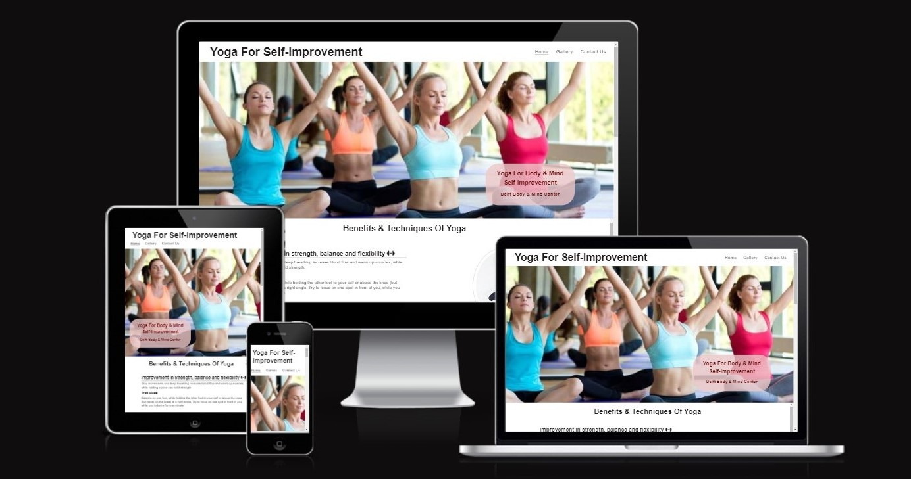
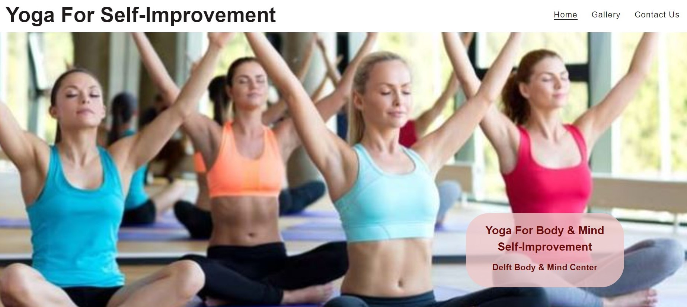
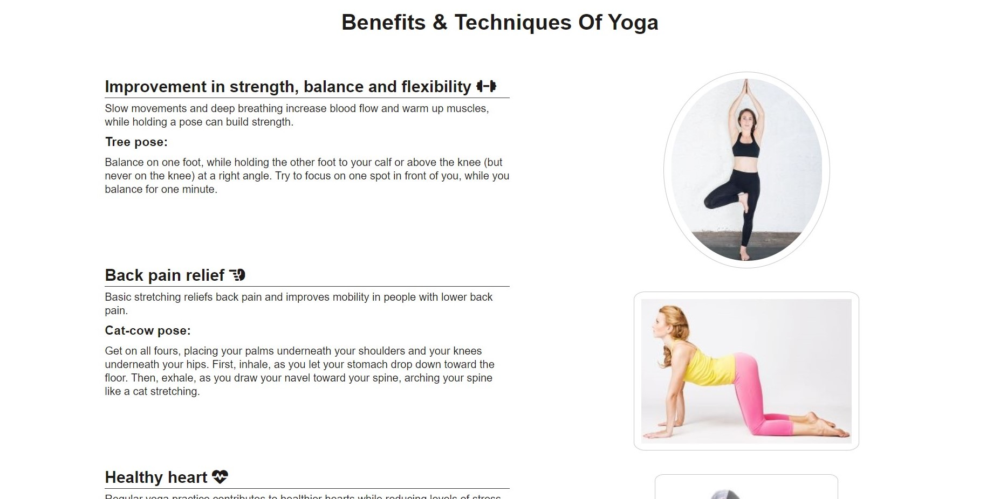
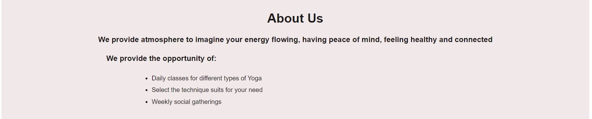
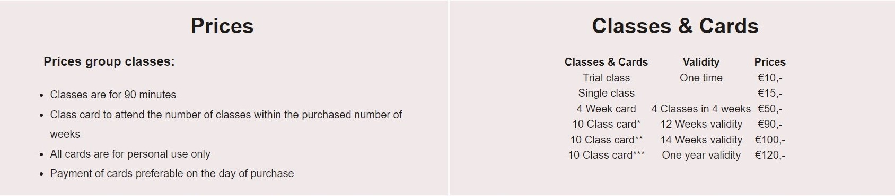
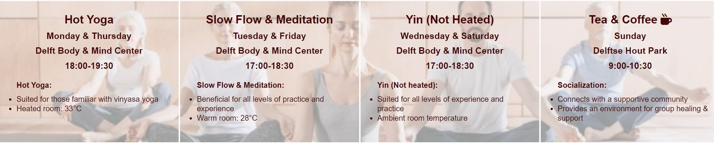
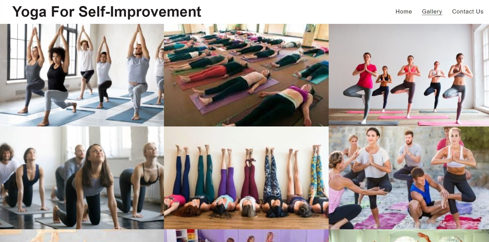
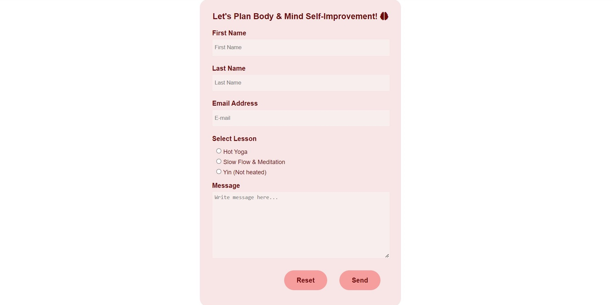
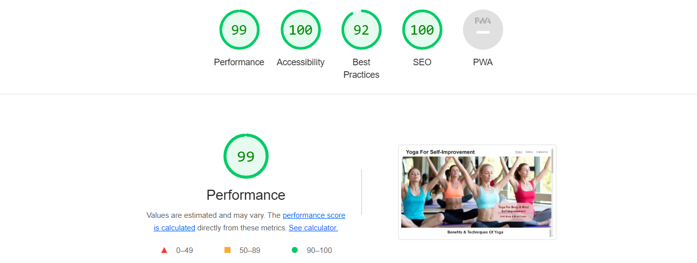
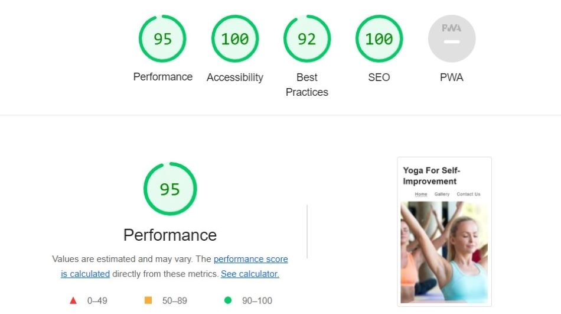

# Yoga For Self-improvement
Yoga For Self-improvement is a site for users who are interested in learning body and mind self-improvement techniques to keep themselves fit as well as looking for a place for socialization. The goal of the site is to motivate and teach user’s specific body and mind self-improvement techniques in Delft, The Netherlands.

# Table of contents
- [UX](#ux)
    - [Website owner business goals](#website-owner-business-goals)
    - [User goals](#user-goals)
    - [User stories](#user-stories)
    - [Structure of the website](#structure-of-the-website)
    - [Surface](#surface)
- [Features](#features)
- [Technologies used](#technologies-used)
- [Testing](#testing)
    - [Code validation](#code-validation)
    - [Functionality testing](#functionality-testing)
    - [Compatibility testing](#compatibility-testing)
    - [Performance testing](#performance-testing)
    - [Issues found during site development](#issues-found-during-site-development)
- [Deployment](#deployment)
- [Credits](#credits)

___
# UX

## Website owner business goals
The goal of the site is to teach users specific body/mind self-improvement techniques

## User goals
### External user’s goal
The site’s users are interested in learning body/mind self-improvement techniques
### New user goals
### Returning user goals:

## User stories
### As a business owner
### As a new customer
### As a returning customer

## Structure of the website

* The design of the website is user-friendy as this is responsive on all type of devices: desktop, laptops, tablets, Ipads, and mobiles.
* On all the above mentioned devices users can have a fantastic experience. 
* All parts of the website are designed to achieve maximum user satisfaction.

## Surface

### Colors
Main colours used in the development of Yoga for Self-improvemnt:
* background color: rgb(239, 200, 200, 0.8); rgba(231, 219, 219, 0.6); rgba(248, 244, 244, 0.6); rgb(246, 224, 224, 0.8); rgb(247, 238, 238); #f69e9e;
* font color: rgb(30, 27, 27); rgb(109, 10, 10); rgb(69, 6, 6); #fafafa
* link color: rgb(30, 27, 27)
* hover color: rgb(30, 27, 27); rgb(109, 10, 10); #f35050
* Horizontal line: #3a3a3a
* Border color: rgb(199, 197, 197); #fafafa; rgb(246, 224, 224)
* Social-networks: rgb(109, 10, 10)

### Fonts 

* As a main font lato and as a backup font sans-serif are used for the contents of the website
* As a main font Oswald and as a backup font sans-serif are used for the headings of the website

### Images

* Images are taken from [Google Images](https://images.google.nl/) which is credited in [credits](#credits) section.

[Back to Table of contents](#table-of-contents)

___
# Features
## Navigation Bar
The full responsive navigation bar is featured on all three pages to allow for easy navigation from page to page across all devices.

* On the left side is logo, which can be used as navigation link to the main page.
* On the right side are links to the Home, Gallery and Contact Us pages.

## The Footer
The footer section is consistent on all pages and includes links to the relevant social media sites for Yoga For Self-improvement.

* The links will open in a separate tab in a browser to allow easy navigation for the users.
* The footer is useful for yoga seekers & yoga lovers to get connected with the community for socialization through social networks.

## Home

* The home page includes a photograph with cover text for the users to get information about the location of Delft Body & Mind Center.
* This inclusion of an eye-catching animation draws the attention of yoga lovers to Yoga for Self-improvement.

### Benefits & Techniques Section
The benefits and techniques section provides information about the benefits and techniques of yoga. In this section the types of yoga pose with description is also provided to get body and mind self-improvement. 

### About Us
About Us section provides information about the provisions and opportunities for yoga lovers at Delft Body & Mind Center. The different types of lessons and prices for classes and cards are also given in this section.

### Prices
This section provides information about the classes and cards for the yoga lessons as well as the validity of the cards.

### Lessons 
This section provides information about the yoga lessons available on different days of the week as well as the possibility of socialization with the yoga lovers at the weekend.

 

## Gallery
The gallery page will provide images to the yoga seekers to have some information about yoga poses. The yoga seekers will be able to identify the types of poses according to their needs.

## Contact Us 
This page will allow yoga seekers to get connected to Yoga for Self-improvement to start learning yoga techniques and socialize with other yoga seekers & yoga lovers.

* Yoga seekers will be able to select among the types of lessons we offer at Delft Body & Mind Center.
* Yoga seekers & yoga lovers will be asked to submit their first name, last name, email address, and message to the administration.

___
# Technologies used
Different technologies were used to complete the contents of Yoga for Self-improvement website.
### GitHub
* As a software hosting platform to keep project in a remote location.
### Git
* As a version-control system tracking.
### Gitpod  
* As a development hosting platform.
### HTML5
* As a structure language.
### CSS
* As a style language.
### Font Awesome
* As an icon library for icons used in benefits of yoga section, social links and Contact Us page.

___
# Testing

## Code validation
Yoga For Self-improvement is validated for a code using two websites.
### HTML
* No errors were found when passing through the official [The W3C Markup Validation Service](https://validator.w3.org/)
### CSS
* No errors were found when passing through the official [The W3C CSS Validation Service](https://jigsaw.w3.org/css-validator/)
 
## Functionality testing
Chrome developer tools were used throughout the project for testing and solving problems with responsiveness and style issues.
 
## Compatibility testing
 Site was tested across multiple virtual mobile devices and browsers.

## Performance testing
[Lighthouse](https://developers.google.com/web/tools/lighthouse/) tool was used to check the performance of the website.
* Couple of changes were made to improve the performance.

### Final results:
* The colors and fonts chosen are easy to read and accessible on desktop. 

* The colors and fonts chosen are easy to read and accessible on mobile.

## Issues found during site development
### Horizontal scrolling bar on the bottom of the screen
Horizontal scrolling bar appeared on the bottom of the screen while adding different sections on the pages. 
* I adjusted the margins to 0 auto in about-us and prices section.
* I adjusted this issue by putting overflow-x to hidden.

{Screen shots to show issues}

[Back to Table of contents](#table-of-contents)

___
# Deployment
The website was deployed on GitHub pages. Gitpod was used as a development environment where all the changes were committed to git version control system. The push command was used in Gitpod to save changes into GitHub.
The following steps were taken to deploy the website:
* Open the GitHub repository, navigate to the Settings tab
* From the source section, select the Main Branch
* Click save and page was deployed after auto-refresh to indicate the successful deployment

## [View life website in github pages](https://humailyas.github.io/Project-1/)

[Back to Table of contents](#table-of-contents)

___
# Credits
To complete the contents of Yoga for Self-improvement website, Code Institute student template was used [gitpod full template](https://github.com/Code-Institute-Org/gitpod-full-template), as well as the information is collected from different sources. 

## Content
* The text for the benefits of yoga for the Home page was taken from [Benefits of Yoga](https://www.hopkinsmedicine.org/health/wellness-and-prevention/9-benefits-of-yoga)
* The types of yoga lessons were selected by getting information from [Inspire Yoga](https://inspireyoga.com)
* The temperature of Hot Yoga was selected by getting information from [Hot Yoga](https://www.yogapedia.com/definition/10696/hot-yoga)
* The temperature of slow flow & meditation was selected by getting information from [Slow Flow-Yoga Moves](https://www.yogamoves.nl/class-styles/slow-flow)
* The information about prices for yoga lessons and cards was taken from [Yoga class prices](https://www.yogashala.nl/en/prices/)
* The icons used in the benefits and techniques of yoga section, footer, and contact us form were taken from [Font Awesome](https://fontawesome.com/)

## Media
* The images used on the Home, Gallery and Contact Us pages were taken from [Google Images](https://images.google.nl/)
